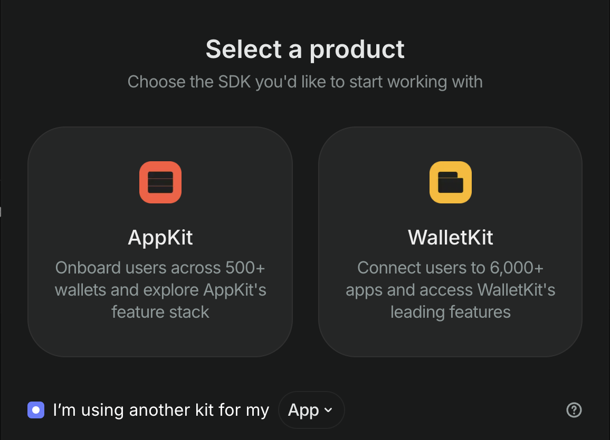
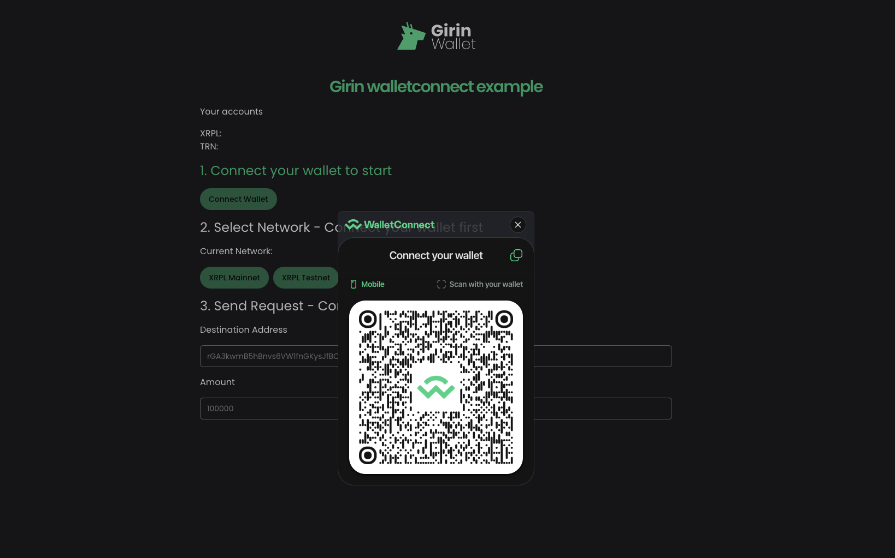
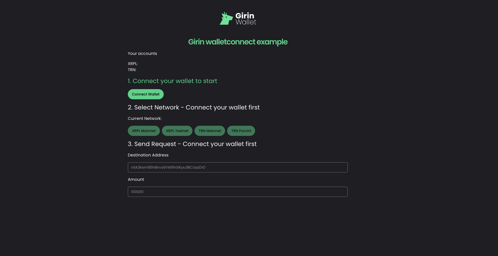

### 해당 GitHub 리포지토리와 문서는 Girin Wallet이 공개한 WalletConnect v2 기반 XRPL 통합 예제를 참고하여, 
### XRPL 개발자들이 유용하게 참고할 수 있도록 최소한의 보완(한글화 등)만 가한 비공식 커뮤니티용 버전입니다. 
### 원본 소스코드와 문서의 권리는 Girin Wallet에 있으며, 본 저장소는 참고 목적만으로 제공됨을 밝힙니다.


* 원본 Docs : https://girin.readme.io/docs/walletconnect-integration

* 원본 소스코드 : https://github.com/girin-app/girin-walletconnect-example

---------------
  
## Getting Started

GirinWallet은 WalletConnect v2를 통해 XRPL을 지원합니다.

- XRPL 스펙: https://docs.reown.com/advanced/multichain/rpc-reference/xrpl-rpc
 - 지원 네트워크: xrpl:0(메인넷), xrpl:1(테스트넷)
 - 지원 메서드: xrpl_signTransaction

## 통합(Integration)

### 사전 준비(Prerequisites)

WalletConnect 연동을 시작하려면 먼저 [cloud.reown.com](https://cloud.reown.com)에서 Project ID를 발급받아야 합니다.

Project ID가 없다면 다음 순서를 따르세요:

1. [cloud.reown.com](https://cloud.reown.com)에 접속해 가입합니다.
2. Projects 탭으로 이동합니다. (@reown/appkit은 XRPL을 지원하지 않으므로 Quick Start 가이드는 건너뜁니다.)
3. 새 프로젝트를 생성할 때 “another kit” 옵션을 선택합니다. (현재는 another kit 옵션이 없기 때문에 Appkit으로 선택)

   

4. 발급받은 Project ID를 .env 파일에 추가합니다:

   ```bash
   NEXT_PUBLIC_PROJECT_ID=your-project-id
   ```

### 설치(Install)

이 예제는 아래 라이브러리를 사용해 구성되었습니다. 공식 WalletConnect v2 문서를 참고해 동일한 방식으로 구현할 수도 있습니다.

```bash
yarn add @walletconnect/modal-sign-react @walletconnect/types @walletconnect/utils
```

### 초기화(Initialize)

최상위 컴포넌트에 WalletConnectModalSign 컴포넌트를 추가하세요:

```ts
import { WalletConnectModalSign } from '@walletconnect/modal-sign-react';
import { getAppMetadata } from '@walletconnect/utils';

export default function Page() {

  return (
    <WalletConnectModalSign
          projectId={process.env.NEXT_PUBLIC_PROJECT_ID}
          metadata={getAppMetadata()}
    />
  )
}
```

### 연결(Connect)

QR 코드를 스캔하여 iOS 또는 Android 지갑을 연결합니다. 연결하려는 네임스페이스를 지정하고 계정 정보를 가져옵니다.



```ts
import { useConnect } from '@walletconnect/modal-sign-react';

import { Button } from '@/components/ui/button';

export function Connect() {
  const { connect, loading: isConnecting } = useConnect({
    requiredNamespaces: {
      xrpl: {
        chains: ['xrpl:0', 'xrpl:1'],
        methods: ['xrpl_signTransaction'],
        events: ['chainChanged', 'accountsChanged'],
      },
    },
  });

  async function onConnect() {
    try {
      const session = await connect();
      console.info('connect result', session);
    } catch (err) {
      console.error(err);
    }
  }
  return (
    <Button
      size="default"
      onClick={onConnect}
      disabled={isConnecting}
      className="w-fit"
    >
      Connect Wallet
    </Button>
  );
}
```

### 연결 해제(Disconnect)

GirinWallet과의 연결을 해제합니다.

```ts
import { useDisconnect } from '@walletconnect/modal-sign-react';
import { getSdkError } from '@walletconnect/utils';
import { SessionTypes } from '@walletconnect/types';

import { Button } from '@/components/ui/button';

export function Disconnect({ session }: { session: SessionTypes.Struct }) {
  const { disconnect, loading: isDisconnecting } = useDisconnect({
    topic: session.topic,
    reason: getSdkError('USER_DISCONNECTED'),
  });

  const onDisconnect = async () => {
    try {
      await disconnect();
      console.info('disconnected');
    } catch (err) {
      console.error(err);
    }
  };

  return (
    <Button onClick={onDisconnect} disabled={isDisconnecting} className="w-fit">
      Disconnect Wallet
    </Button>
  );
}
```

### 트랜잭션 전송(SendTransaction)

아래 예시는 XRPL로 트랜잭션을 전송하는 방법을 보여줍니다. 응답 형식 등 자세한 내용은 WalletConnect v2의 XRPL 스펙을 참고하세요.

```ts
'use client';

import { useRequest } from '@walletconnect/modal-sign-react';

import { Button } from '@/components/ui/button';

import { NETWORK, NETWORK_MAP } from '@/lib/network';

interface Props {
  topic: string;
  account: string;
  network: NETWORK;
  amount: string;
  destination: string;
}

// TODO
type XrplSignTransactionResponse = unknown;

export function Send({ topic, network, account, amount, destination }: Props) {
  // https://docs.reown.com/advanced/multichain/rpc-reference/xrpl-rpc#xrpl_signtransaction
  const { request: xrplSendTransaction } =
    useRequest<XrplSignTransactionResponse>({
      chainId: network, // xrpl:0, xrpl:1
      topic, // session.topic
      request: {
        method: 'xrpl_signTransaction',
        params: {
          tx_json: {
            TransactionType: 'Payment',
            Account: account,
            Destination: destination,
            Amount: amount,
          },
        },
      },
    });

  const onSendTransaction = async () => {
    try {
      const result = await xrplSendTransaction();
      console.info('sendTransaction result', result);
    } catch (err) {
      console.error(err);
    }
  };

  return (
    <Button
      className="w-fit"
      onClick={onSendTransaction}
      disabled={!account || !amount || amount === '0' || !destination}
    >{`xrpl_signTransaction to ${NETWORK_MAP[network]}`}</Button>
  );
}
```

## 예제(Example)

아래 예제를 통해 GirinWallet과의 통합 테스트를 쉽게 수행할 수 있습니다.



- Demo : https://walletconnect-example.netlify.app/
- Source : https://github.com/girin-app/girin-walletconnect-example

```bash
yarn
yarn dev
# 브라우저에서 [http://localhost:3000](http://localhost:3000) 을 열어 동작을 확인하세요.
```
